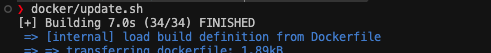
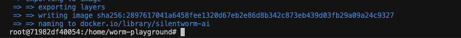
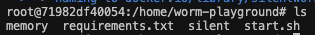
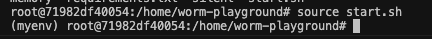
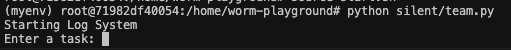
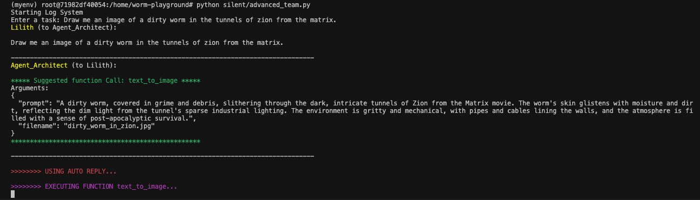

<p align="center">
  <a href="" rel="noopener">
 </a>
</p>

<h3 align="center">Silent.Worm</h3>

<div align="center">

[]()
[](https://github.com/zy0n/silent.worm/issues)
[](https://github.com/zy0n/silent.worm/pulls)
[](/LICENSE.md)

</div>

---

<p align="right">Silent.Worm thrives on the power of collaboration, where individual AI agents work together seamlessly to accomplish tasks that may be too intricate for a single entity.
    <br> 
</p>

## 📝 Table of Contents

- [About](#about)
- [Getting Started](#getting_started)
- [Usage](#usage)
- [Built Using](#built_using)
- [TODO](../TODO.md)
- [Contributing](../CONTRIBUTING.md)
- [Authors](#authors)
- [Acknowledgments](#acknowledgement)

## 🧐 About <a name = "about"></a>

Silent.Worm is an innovative AI agent swarm designed to tackle complex tasks and challenges by harnessing the collective intelligence of a network of artificial intelligence agents. Developed with cutting-edge technologies, Silent.Worm operates as a cohesive unit, demonstrating adaptability, learning capabilities, and efficient problem-solving.

## 🏁 Getting Started <a name = "getting_started"></a>

These instructions will get you a copy of the project up and running on your local machine for development and testing purposes. See [deployment](#deployment)

### Prerequisites

What things you need to install the software and how to install them.

```
Python 3.11
========= docker use only ======
docker 
2GB hdd space for docker image
```

### Installing
##### If running locally, make sure all deps are installed.
```sh
# activate virtual-environment
pip install -r requirements.txt
```
##### If running in docker, install deps in the docker.
```sh
# available scripts to run
docker/build.sh # builds docker
docker/run.sh # runs docker
docker/update.sh # builds docker & launches

```

## 🎈 Usage <a name="usage"></a>
- ###### Building Docker image & running.

- ###### ... docker image built.

- ###### home directory structure, memory is used as persistent data for the sandbox

- ###### load the python environment

- ###### running example team

- ###### running example advanced team (can spawn their own agents, and have toolbelt of functionality) & example image generation task


## ⛏️ Built Using <a name = "built_using"></a>

- [autogen](https://www.github.com/microsoft/autogen) - AI Agent Framework
- [Python](https://python.org/en/) - Server Environment

## ✍️ Authors <a name = "authors"></a>

- [@zy0n](https://github.com/zy0n) - Idea & Initial work

See also the list of [contributors](https://github.com/zy0n/silent.worm/contributors) who participated in this project.

## 🎉 Acknowledgements <a name = "acknowledgement"></a>
- Hat tip to anyone whose code was used
   - microsoft/autogen/notebooks
- Inspiration
  - lyfe
- References
  - brain